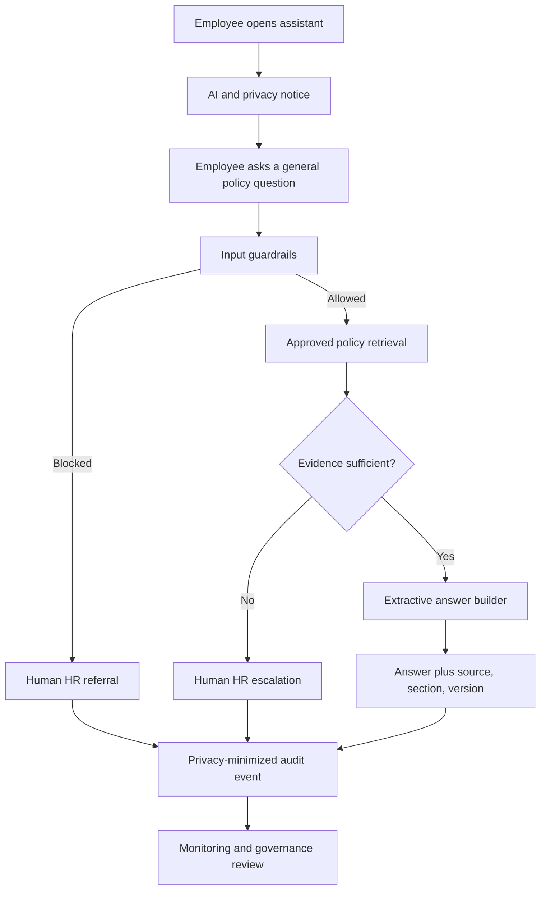

# HR AI Governance POC — Stage 1

A GitHub-ready, public-safe portfolio project showing how an HR policy assistant can be designed, controlled, tested, and documented from business problem through governance evidence.

## Business problem

Employees frequently ask HR routine questions about leave, remote work, and expense reimbursement. HR spends time answering repeated questions, and employees may rely on inconsistent or outdated guidance.

## MVP solution

The fictional company **ssp-dev-hr-aigovern-poc** uses an offline policy assistant that:

- displays an automated-system and privacy notice;
- answers only general policy questions;
- blocks personal data and confidential HR information;
- prevents hiring, ranking, promotion, disciplinary, or termination decisions;
- searches only approved synthetic policy documents;
- returns an extractive answer with source, section, and version;
- escalates unsupported questions to HR;
- logs only control metadata, not the raw question;
- runs automated governance tests.

## End-to-end flow

## Technology stack

| Layer | Technology |
|---|---|
| Language | Python 3.10+ |
| User interface | Streamlit |
| Retrieval | Local dependency-free similarity search |
| Knowledge base | Synthetic text policies |
| Guardrails | Python rules and regular expressions |
| Tests | Python `unittest` |
| Audit evidence | JSON Lines; no raw question |
| CI | GitHub Actions |
| Governance evidence | Markdown and JSON |
| Stage 2 model | Claude API, optional and not included |

## Start

Read [`START_HERE.md`](START_HERE.md).

## Regulatory scope

The project demonstrates control design aligned to:

- the EU AI Act;
- GDPR;
- India's Digital Personal Data Protection Act, 2023 and Rules, 2025;
- ISO/IEC 42001:2023.

It does not claim certification or legal compliance. Applicability and final controls require qualified legal, privacy, security, HR, and regulatory review.

## Public-use safety

All company names, policies, employees, and records are fictional. Do not add real personal information, confidential company policies, or API keys to the repository.

## License

MIT.
