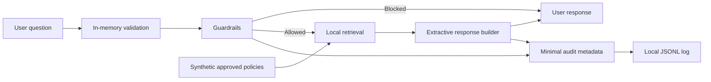

# 05 — Data Inventory and Flow

## Data inventory

| Data item | Source | Classification | Purpose | Retained? |
|---|---|---|---|---|
| Synthetic policy text | Repository | Internal Synthetic | Answer general questions | Yes |
| Policy metadata | Repository | Internal Synthetic | Traceability | Yes |
| User question | User input | Potential personal data | Temporary evaluation and retrieval | No |
| Guardrail category | Application | Operational metadata | Control evidence | Yes |
| Decision: answered/blocked/escalated | Application | Operational metadata | Monitoring | Yes |
| Source document title | Application | Internal Synthetic | Audit evidence | Yes |
| Raw answer | Application | Potential content data | Display only | No |

## Data flow

## Data minimization design

- No login is required in Stage 1.
- No employee database exists.
- The question is not written to disk.
- The answer is not written to disk.
- Only categories, applied controls, decision, timestamp, and synthetic source title may be logged.
- Policies are fictional and marked `Internal Synthetic`.
- The loader rejects documents not marked `Approved for POC`.

## Retention

Local audit logs are for demonstration only. The target design is 30 days, followed by deletion. Stage 1 does not include an automated deletion job; this limitation is documented and must be addressed before production.
