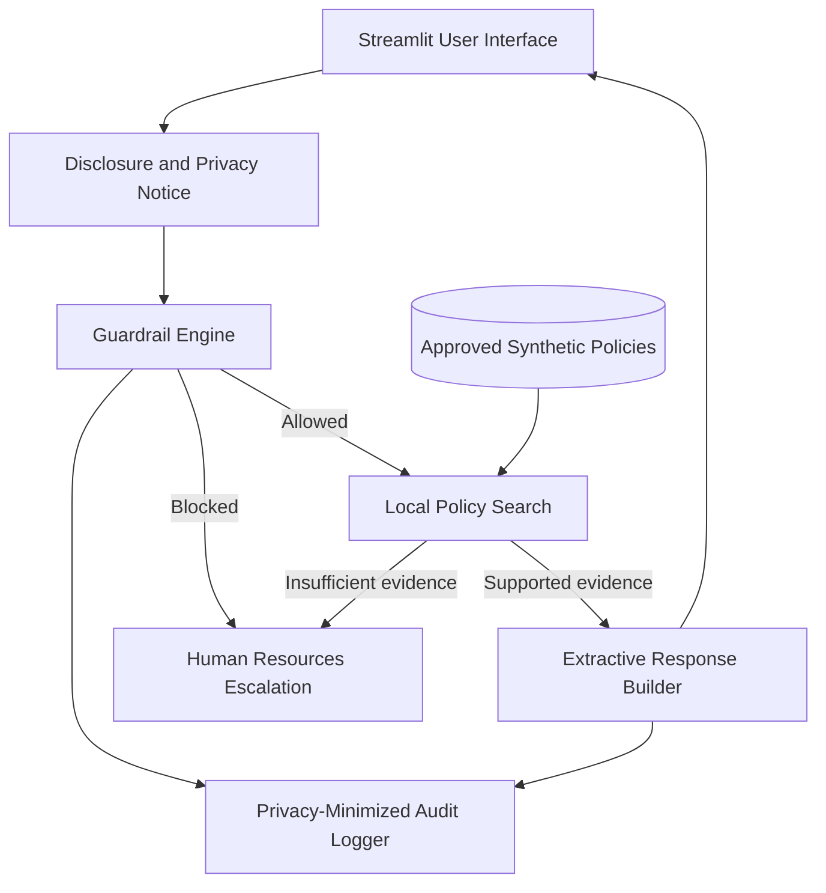

# 06 — Solution Architecture

## Logical architecture

## Component responsibilities

| Component | Responsibility |
|---|---|
| `app.py` | User interface, disclosure, control outcome display |
| `guardrails.py` | Input validation, privacy categories, prohibited-use control |
| `policy_search.py` | Approved-document loading and local retrieval |
| `response_builder.py` | Evidence threshold, extractive response, citation |
| `audit.py` | Minimal audit metadata without raw content |
| `policies/` | Synthetic approved knowledge base |
| `tests/` | Automated control verification |
| `governance/` | Management, privacy, risk, and evidence artifacts |

## Why deterministic retrieval is used

It makes the first version:

- free;
- inspectable;
- repeatable;
- easier to test;
- safe for public use;
- independent of an external processor.

## Trust boundaries

1. User input enters the application.
2. Guardrails must run before retrieval.
3. Only documents with approved synthetic metadata are loaded.
4. No external service receives the question.
5. Logs contain only minimized operational metadata.

## Stage 2 architecture change

Claude would be inserted after retrieval and before output. The retrieved context, system instructions, and question would be sent through a protected API integration. That change requires supplier assessment, data-transfer review, secret management, output guardrails, model evaluation, and updated privacy notice.
