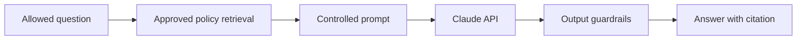

# 26 — Stage 2 Claude Roadmap

## Goal

Use Claude to create natural, concise responses from retrieved approved policy context.

## Architecture insertion

## New work required

1. Create Anthropic Console/API account and protected key.
2. Complete supplier assessment.
3. Confirm data-processing and retention terms.
4. Assess international transfer requirements.
5. Add secrets management.
6. Define exact model and version.
7. Build controlled system prompt.
8. Send only minimum approved context.
9. Add output PII and unsupported-claim checks.
10. Add hallucination and prompt-injection evaluations.
11. Record model version and latency, not raw HR content.
12. Update user notice and privacy assessment.
13. Obtain approval before real data.
14. Add cost and rate limits.
15. Create rollback to Stage 1.

## Production gate

Claude integration may use only synthetic data until HR, privacy, security, legal, and AI governance approve real-company use.
